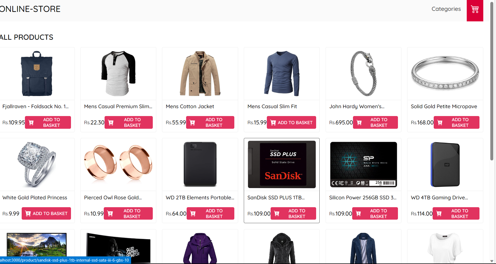
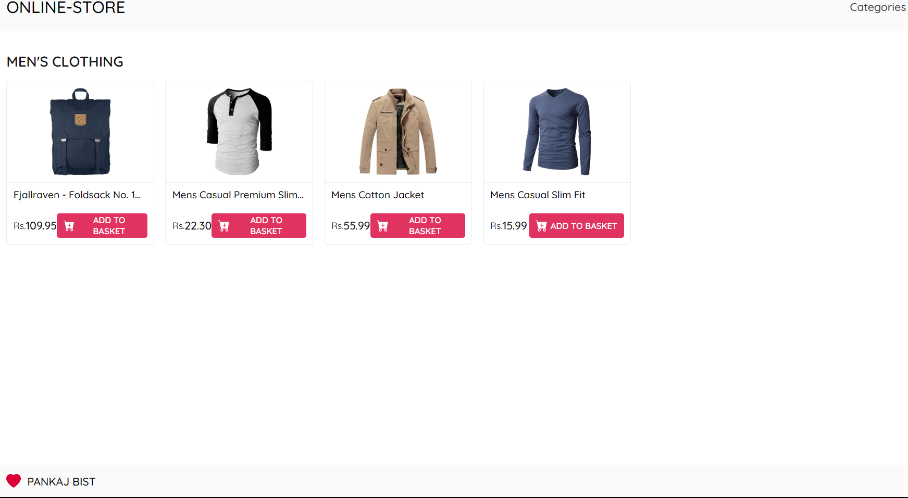
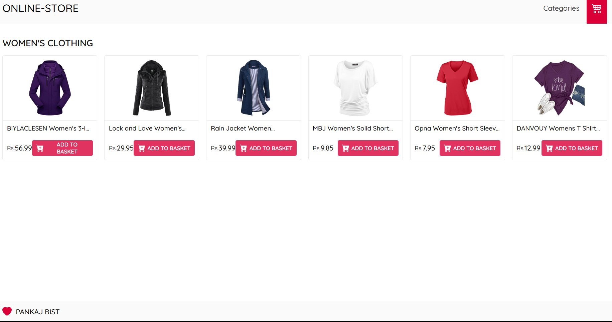
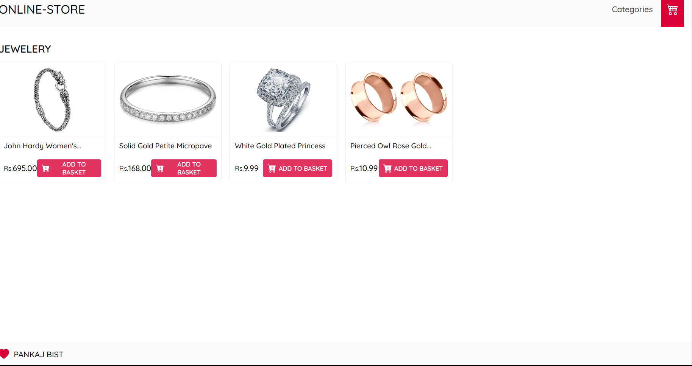
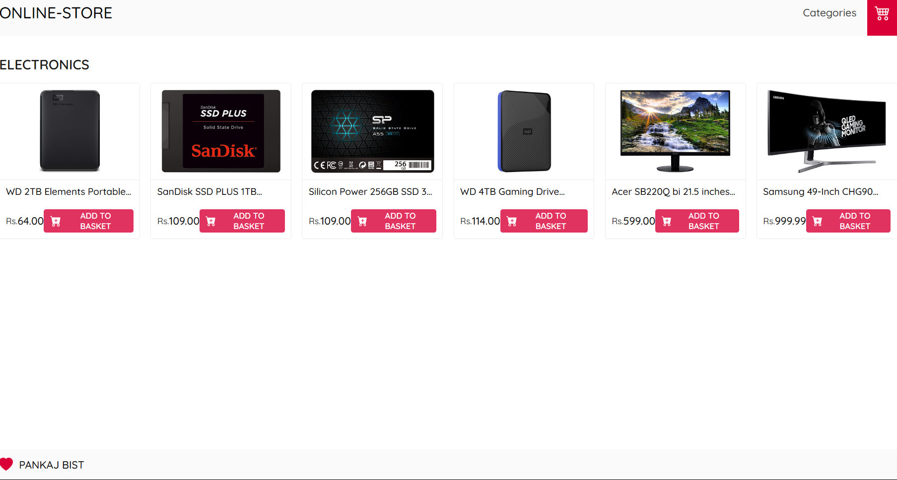
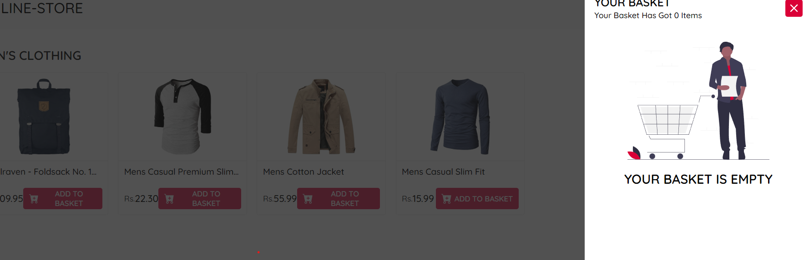
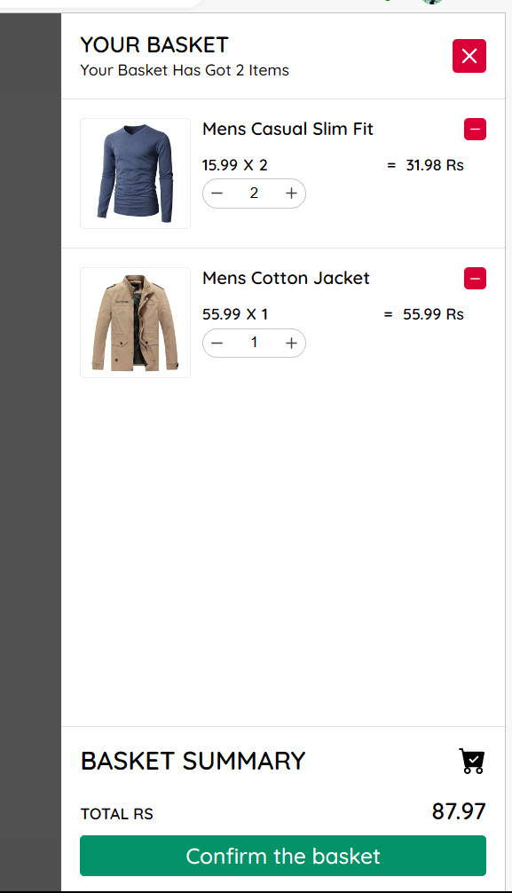

Ths project directory, you can run:
### `npm install`
### `npm start`

Runs the app in the development mode.
Open [http://localhost:3000](http://localhost:3000) to view it in your browser.

The page will reload when you make changes.

You may also see any lint errors in the console.

**Hurray, Your app is now running on port 3000 in your browser**

## Screenshots

### Landing Page

### Category Page

on click categories it shows 4 properties thhese are
### Mens Clothing

### Womens Clothing

### Jewelery

### Electronics

### BASKET
on click basket without add any item 
### Empty Basket

if you add any item
### Basket With Item

### Thank You 
